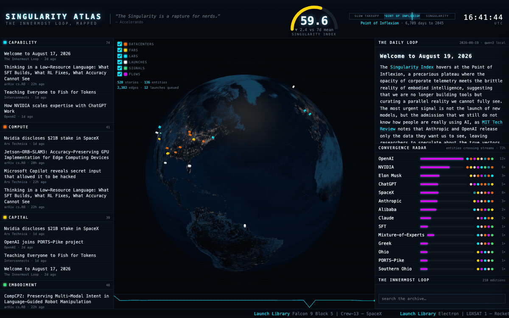
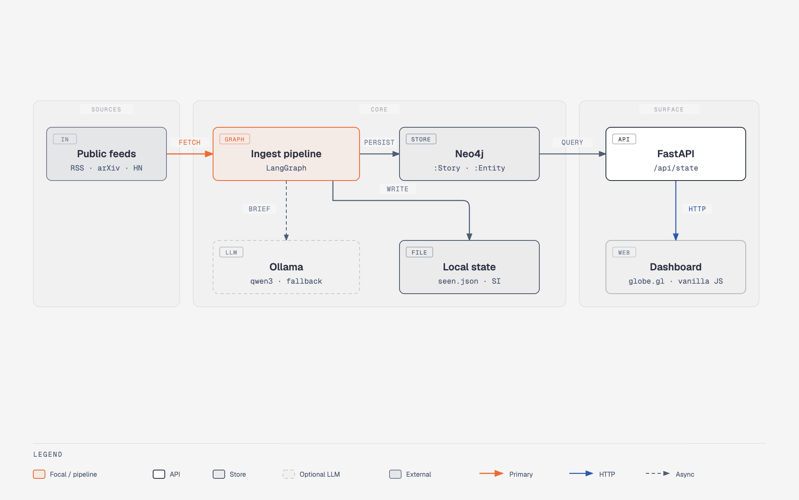

<table>
  <tr>
    <td>
      <strong><a href="https://github.com/sw30labs/.github/wiki/singularity-atlas">Wiki · The Singularity Atlas</a></strong><br />
      Argument, architecture, layer table. Local live board vs the public 24h snapshot.
    </td>
  </tr>
</table>

# The Singularity Atlas

The news of the AI build-out — models, fabs, capital, robots, launches — does not arrive as one story. **The Singularity Atlas is a local situational-awareness dashboard that fuses those public feeds into a globe, eight live vectors, a composite Singularity Index, and a daily brief, so you can watch the approach in one place instead of fourteen tabs.**



What you get when it boots: datacenters, fabs, labs and pads on a 3D globe; Capability · Compute · Capital · Embodiment · Agency · Security · Space · Culture as live panels; entities that cross two or more streams in 72 hours; a 0–100 index with a Slow Takeoff → Point of Inflexion → Singularity dial; and *The Daily Loop*, written on-machine (Ollama) or by heuristics if the LLM is down. No API keys, no account, nothing uploaded.

```
./setup_and_run.sh --sync      # deps + neo4j + seed + Loop feed + first ingest + serve → http://localhost:8055
```

Fresh machine from a clone: [QUICKSTART.md](QUICKSTART.md).

<details>
<summary>Ideas borrowed from worldmonitor, and what they became here</summary>

| worldmonitor | The Singularity Atlas |
|---|---|
| 3D globe (globe.gl) + layer catalog | Same library. Layers: datacenters, fabs, labs, launch pads + upcoming launches, geolocated AI signals, co-mention flow arcs |
| Panel inventory | 8 vector panels: Capability · Compute · Capital · Embodiment · Agency · Security · Space · Culture |
| AI-synthesized briefs | **The Daily Loop** — qwen3 (Ollama) writes today's edition from the top signals |
| Country Instability Index | **Singularity Index** — composite 0–100, 8 sub-indices, sparkline, Stross epoch dial (Slow Takeoff → Point of Inflexion → Singularity) + countdown to 2045 |
| Cross-stream correlation | **Convergence radar** — entities crossing ≥2 streams in 72h (click for constellation + "Alex wrote about this") |
| Feed freshness tracking | `/api/feeds` health (last fetch, items, errors) |
| Local AI via Ollama | Same. Zero API keys, zero registration |

Plus what only this atlas has: the **Loop Archive** — the *Innermost Loop* editions
(kept current from the author's official Substack feed) seeded into the graph
and full-text searchable —
and the *Accelerando* epoch dial with rotating Stross quotes.

</details>

## Architecture



- Ingest runs every 15 min **inside the dashboard process** (APScheduler, not
  cron — it stops when uvicorn does); `POST /api/ingest` for a manual cycle,
  `POST /api/brief/regenerate` to re-synthesize today's edition.
- The Loop Archive syncs daily from the author's official Substack feed. New
  editions are written to `data/loop_issues/` and pushed straight into the
  graph; `POST /api/archive/sync` pulls immediately. `/api/state.loop_sync`
  reports when the feed was last checked and what arrived.
- The LLM is optional: everything degrades to heuristics when Ollama is offline.

## Setup

Clone-from-scratch, prerequisites, and what a fresh clone does *not* include:
[QUICKSTART.md](QUICKSTART.md).

```bash
uv sync
docker compose up -d          # singularity-atlas-neo4j: http :7476 · bolt :7689 (neo4j/singularity-atlas)
ollama pull qwen3.8:27b-mtp-bf16                    # optional, for the LLM brief (any qwen3 works — auto-detected)
uv run python -m singularity_atlas.seed           # local archive → graph (once)
./setup_and_run.sh --sync                         # or all of the above in one step, plus Loop feed + first ingest
```

Useful CLIs: `uv run python -m singularity_atlas.feeds` (smoke-test all feeds) ·
`uv run python -m singularity_atlas.pipeline` (one ingest cycle).

`./setup_and_run.sh` is the canonical entry point (`--setup-only`, `--no-tests`,
`--sync`, `--help`); it runs one feed ingest before serving so the dashboard
is not empty on first paint, then uvicorn's scheduler keeps ingesting every
15 min (not cron). It clears a stale dashboard holding the port before
starting, since a forgotten instance keeps ingesting in the background.
`scripts/dev.sh` is a shim that forwards to it.

## Configuration

Everything lives in `singularity_atlas/config.py`: feeds, vector weights, epoch years,
globe site catalog, ports, model name. Env overrides: `ATLAS_PORT`, `ATLAS_NEO4J_URI`,
`ATLAS_NEO4J_PASSWORD`, `ATLAS_MODEL`, `OLLAMA_HOST`.

## Notes

- `ref/innermost-loop/` is **not in version control**: the newsletter archive is
  all-rights-reserved third-party content, so it is kept locally and never
  published. A fresh clone therefore starts with an empty archive — the archive
  panels return nothing until the daily sync (or `POST /api/archive/sync`)
  populates `data/loop_issues/` from the public feed, which exposes the latest
  20 editions. *Accelerando* is not in the repo either — read it from the
  author's free edition (link in [NOTICE](NOTICE)).
- Nothing is uploaded anywhere.
- Feeds are all public: no auth, no registration, no API keys.
- Neo4j browser: http://localhost:7476 (try `MATCH (e:Entity)<-[:MENTIONS]-(s:Story)
  RETURN e, s LIMIT 80`).
- The README gif is a capture of the live dashboard (`docs/dashboard.gif`).
  Regenerate with the server up: `uv run --with playwright python scripts/capture_readme_gif.py`
  (`?demo=1` slightly speeds the globe and ticker so ten seconds of gif still shows motion).
- Architecture figure source: `docs/architecture.html` (diagram-design). The PNG is a
  diagram-only export of that file.

## Licence

Apache 2.0 — see [LICENSE](LICENSE). That grant covers the code in this
repository only.

It does **not** cover `ref/`, which is gitignored: a local *Accelerando*
(Charles Stross, CC BY-NC-ND 2.5) and a local *Innermost Loop* archive
(Dr. Alex Wissner-Gross, all rights reserved) may sit on a developer's
machine, but this repository does not redistribute either. [NOTICE](NOTICE)
records the full attribution, the acknowledgements, and the scope of each
licence.
